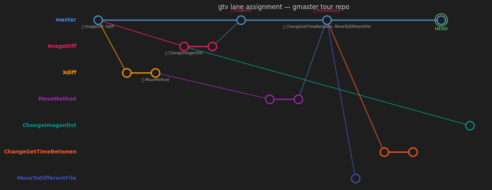

# gtv — Git Timeline Viewer

<p align="center">
  
</p>

**gtv** is a desktop app that turns your git history into a horizontal timeline of
branch lanes: every branch gets its own track, is born at a fork point, lives its
life left-to-right, and folds back into its parent at a merge. One glance tells you
which lines are alive, where they came from, and where they landed.

<p align="center">
  
</p>

## Why gtv

`git log --graph` is linear text. It can't answer the questions you actually have
when you open an unfamiliar repo — or return to your own after a month:

- *What branches exist right now, and which ones are still alive?*
- *Where did this branch start, and did it ever merge back?*
- *What landed on main this week, and what's still floating around unmerged?*

gtv answers these visually, from **pure git data** — no server, no metadata store,
no account. Point it at any local repository and it reconstructs branch lineage
from the commit graph itself.

## Features

**The graph**
- Branch lanes reconstructed from DAG structure (first-parent lane propagation,
  merged-branches-first priority, tip protection)
- Fork points drawn as right-angle birth lines; merges as thin curves, both labeled
- Tags and branch refs as stacked badges pinned to their commit — collision-resolved,
  never overlapping
- Node size encodes change volume; HEAD is marked
- Time-proportional x-axis with a sticky, zoom-adaptive ruler
  (`2026` → `2026-07` → `2026-07-17` → `… 15:04` → `… 15:04:05` — adjacent ticks
  never repeat)

**Handling big repos**
- Smart compression: by default only key commits render (lane births, tips, merge
  endpoints, tagged commits, HEAD); click a `+N` chip on a lane bar to expand
- Viewport culling: only what you see is in the render tree
- Lane names pinned to the left edge as constant-size chips; click to focus a lane
  (dims everything else), right-click for lane actions
- Branch panel: search, newest-first ordering, All / None, double-click a chip to
  solo that branch

**Interaction**
- Trackpad-native: two-finger scroll pans, pinch zooms around the cursor
- Click an edge to highlight its endpoint commits; `Ctrl+click` jumps to the
  parent, `Shift+click` jumps to the child
- Minimap with live viewport rectangle and click-to-jump
- Commit detail panel: author, full message, refs, changed files with `+/-` stats
- Remembers your last repository

**Read-only.** gtv never modifies your repository.

## Development

```bash
npm install
npm run tauri dev            # run the app
cd src-tauri && cargo test   # lane engine tests + real-repo benchmark
```

## Architecture

Tauri 2 + React 19 + D3. The backend reads the repo with git2; the lane engine is
a pure, unit-tested module with no git dependencies.

```
src-tauri/src/
  layout.rs       lane-propagation engine (pure functions, hand-built graph tests)
  git_reader.rs   git2 access: refs, revwalk from all branch tips, diff stats
  commands.rs     Tauri commands
src/
  components/Timeline.tsx      D3 timeline: lanes, edges, badges, minimap, ruler
  components/CommitDetails.tsx commit detail panel
docs/
  roadmap.md          where gtv goes next
  design-v2.md        lane algorithm + rendering spec
  gmaster-research.md research notes
  reference/          archived reference material
```

## Roadmap

Near-term: anomaly-gap compression for the time axis, inactive-lane collapsing,
related-branch filtering, date-range filter, jump-to-commit search, two-commit
diff. See [docs/roadmap.md](docs/roadmap.md).

## Acknowledgments

gtv's lane-timeline view is inspired by **gmaster**'s Branch Explorer
(Codice Software) — a beautiful idea that deserved a living heir. Thank you for
showing what git history could look like. gtv is its own project: new code, new
interaction model, and its own road ahead. Research notes and archived reference
material live in `docs/`.

## License

MIT
