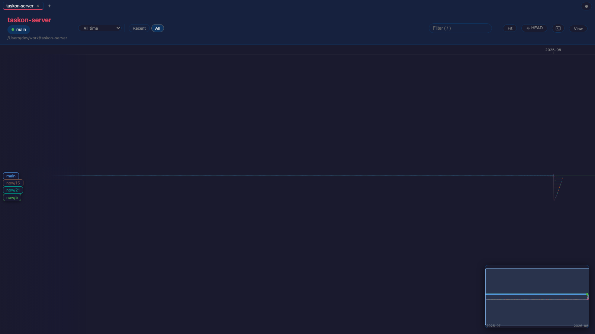
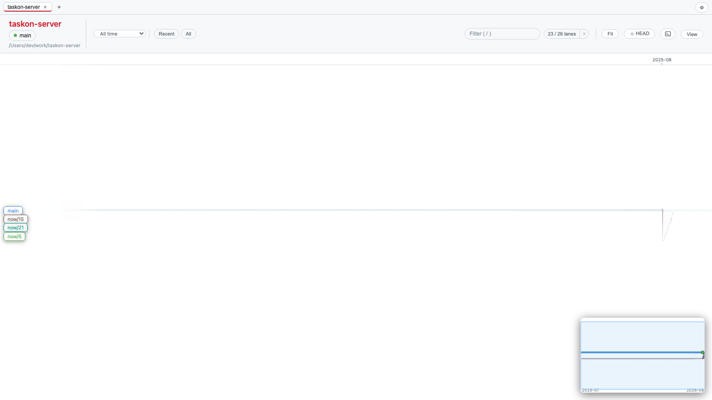
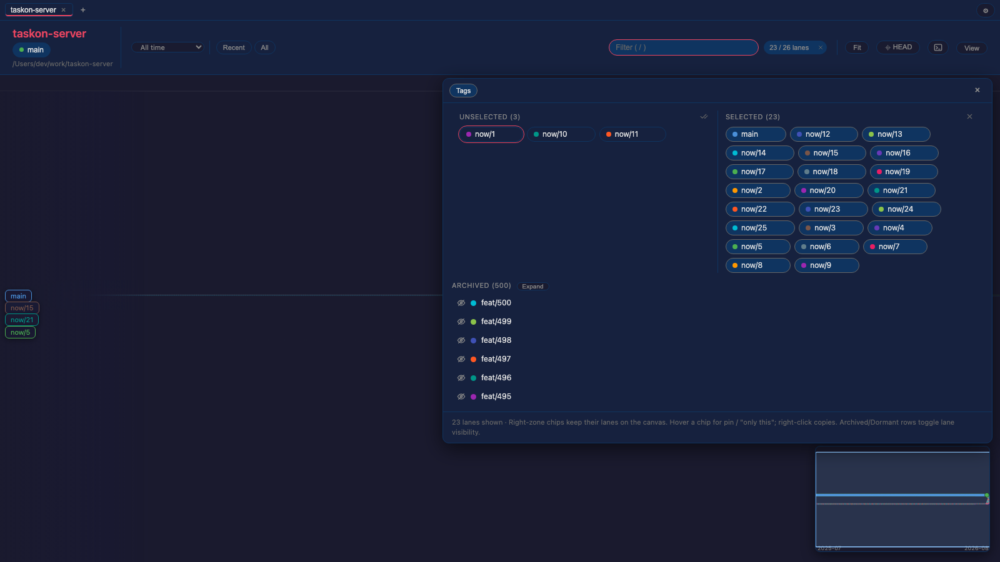
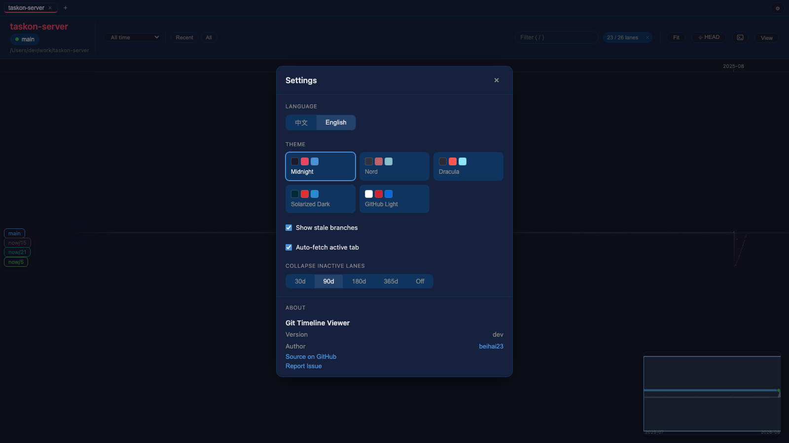

# gtv — Git Timeline Viewer

<p align="center">
  
</p>

**gtv** is a desktop app that turns your git history into a horizontal timeline of
branch lanes: every branch gets its own track, is born at a fork point, lives its
life left-to-right, and folds back into its parent at a merge. One glance tells you
which lines are alive, where they came from, and where they landed.

<p align="center">
  
</p>
<p align="center">
  
  
</p>
<p align="center">
  
</p>

## Why gtv

`git log --graph` is linear text. It can't answer the questions you actually have
when you open an unfamiliar repo — or return to your own after a month:

- *What branches exist right now, and which ones are still alive?*
- *Where did this branch start, and did it ever merge back?*
- *What landed on main this week, and what's still floating around unmerged?*

gtv answers these visually, from **pure git data** — no server, no metadata store,
no account. Point it at any local repository and it reconstructs branch lineage
from the commit graph itself.

## Features

**The graph**
- Branch lanes reconstructed from DAG structure (first-parent lane propagation,
  merged-branches-first priority, tip protection)
- Fork points drawn as right-angle birth lines; merges as thin curves, both labeled
- Tags and branch refs as stacked badges pinned to their commit — collision-resolved,
  never overlapping
- Node size encodes change volume; HEAD is marked
- Time-proportional x-axis with a sticky, zoom-adaptive ruler
  (`2026` → `2026-07` → `2026-07-17` → `… 15:04` → `… 15:04:05` — adjacent ticks
  never repeat); dead gaps over 45 days fold into fixed-width axis breaks

**Handling big repos**
- Smart compression: by default only key commits render (lane births, tips, merge
  endpoints, tagged commits, HEAD); click a `+N` chip on a lane bar to expand
- Viewport culling: only what you see is in the render tree
- Lane names pinned to the left edge as constant-size chips; click to focus a lane
  (dims everything else), right-click for lane actions ("related branches only",
  switch branch, compare with HEAD, …)
- Ref panel (`/`): a two-zone chip picker — position carries the state, selected
  lanes on the right, dragging a chip across the divider toggles it; hover for
  pin / "only this", right-click copies the name; a Tags tab plus Archived /
  Dormant groups whose eye-rows toggle a lane's visibility

**Slicing the data**
- Header scope cluster: a date scope (week / month / quarter / year / custom —
  lanes that empty out sink into the trace rows) ahead of the lane presets
  (Recent / Pinned / All)
- While a lane subset is selected, a status pill in the header shows `n / m
  lanes`; click the count to reopen the picker, click × to show every lane again
- Full-history commit search (`Cmd/Ctrl+F`) over message / author / hash, with
  ancestry jump-to for hits outside the loaded range
- `Ctrl/Cmd+click` two commits (or a lane menu entry) to compare them: per-file
  `+/-` counts and line-level diffs in a side-by-side detail view

**Interaction**
- Trackpad-native: two-finger scroll pans, pinch zooms around the cursor
- Click an edge to highlight its endpoint commits; `Ctrl+click` jumps to the
  parent, `Shift+click` jumps to the child
- Minimap with live viewport rectangle and click-to-jump
- Commit detail panel: author, full message, refs, changed files with `+/-` stats
  and per-file diffs
- Settings (`⌘,`): Chinese/English UI, five preset themes (Midnight, Nord,
  Dracula, Solarized Dark, GitHub Light)
- Multi-repo tabs: several repositories side by side in one window — the
  tab set and the active tab are restored on the next launch (in-tab view
  state and the terminal panel are deliberately not auto-restored),
  worktree families group into second-level tabs, and dropping a repository
  folder anywhere on the window opens it

**Read-only, two deliberate exceptions.** gtv does not modify your
repository — the only writes it ever performs are a branch switch you
explicitly confirm (compatible uncommitted changes are carried over safely,
and if they conflict with the target branch the switch fails cleanly,
before writing anything; a branch already checked out by another worktree
of the same family is refused up front) and a background auto-fetch of the
active tab's remotes every 60 s, which updates tracking refs
(+auto-followed tags) & objects & FETCH_HEAD only — never your worktree,
local branches, HEAD, or stash. Nothing is discarded or force-overwritten.
The fetch shells out to your system `git`, so your credential helpers,
ssh-agent, and proxy settings apply as-is; when it fails (offline, private
HTTPS without credentials) it stays silent and tries again on the next
tick. The integrated terminal is a plain shell where you type your own
commands; that is you working, not gtv writing.

## Download

Prebuilt binaries for macOS (universal), Windows, and Linux are on the
[Releases](https://github.com/beihai23/gtv/releases) page.

**macOS note:** the app is not notarized, so Gatekeeper may refuse to open it
("app is damaged" / "can't be opened"). Remove the quarantine flag once after
installing:

```bash
xattr -d com.apple.quarantine /Applications/Git\ Timeline\ Viewer.app/
```

(Adjust the path if you moved the app somewhere else.)

## Development

```bash
npm install
npm run tauri dev            # run the app
cd src-tauri && cargo test   # lane engine tests + real-repo benchmark
```

## Architecture

Tauri 2 + React 19 + D3. The backend reads the repo with git2; the lane engine is
a pure, unit-tested module with no git dependencies.

```
src-tauri/src/
  layout.rs       lane-propagation engine (pure functions, hand-built graph tests)
  git_reader.rs   git2 access: refs, revwalk from all branch tips, diff stats
  commands.rs     Tauri commands
src/
  components/Timeline.tsx      D3 timeline: lanes, edges, badges, minimap, ruler
  components/CommitDetails.tsx commit detail panel
  components/DiffView.tsx      line-level diffs, shared by detail & compare views
docs/
  roadmap.md          where gtv goes next
  design-v2.md        lane algorithm + rendering spec
  gmaster-research.md research notes
  reference/          archived reference material
```

## Roadmap

The 2026-08/09 wave shipped: inactive-lane collapsing, anomaly-gap compression
for the time axis, full-history commit search, date-range scoping,
related-branch filtering, two-commit compare, branch switch with dirty-tree
confirmation, and multi-repo tabs. Next up is a visual-language pass —
double-line lanes, node state encoding, a HEAD home icon, ahead/behind badges.
See [docs/roadmap.md](docs/roadmap.md).

## Acknowledgments

gtv's lane-timeline view is inspired by **gmaster**'s Branch Explorer
(Codice Software) — a beautiful idea that deserved a living heir. Thank you for
showing what git history could look like. gtv is its own project: new code, new
interaction model, and its own road ahead. Research notes and archived reference
material live in `docs/`.

## License

MIT
